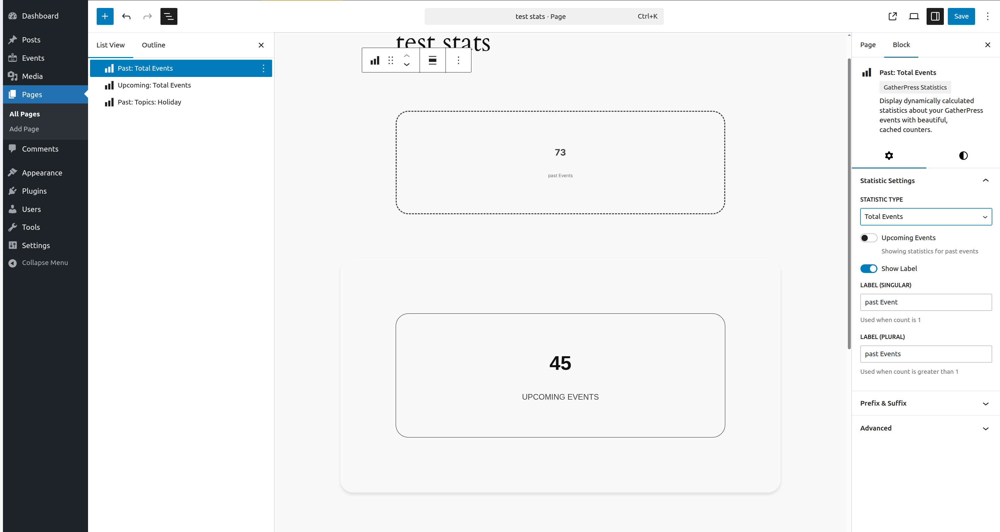
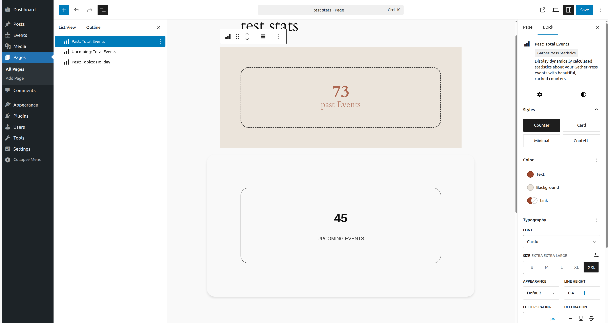
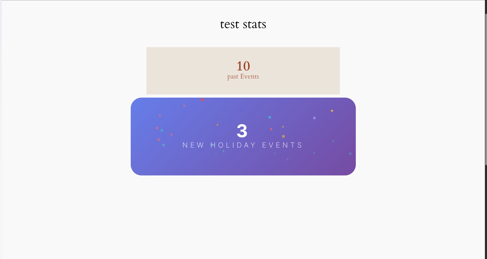
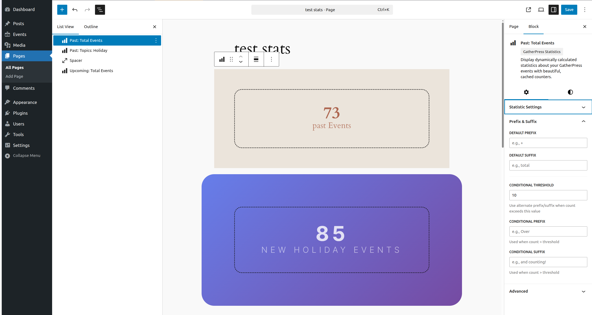
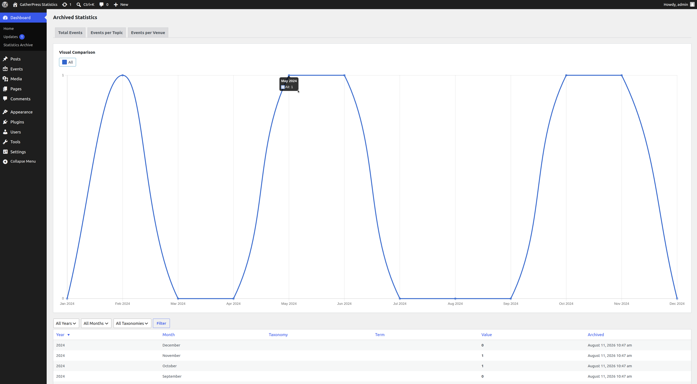
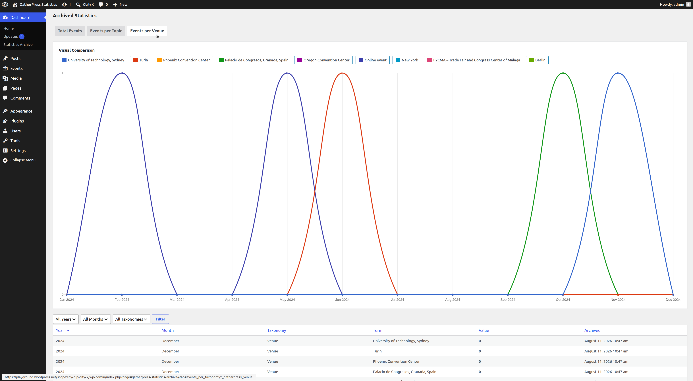
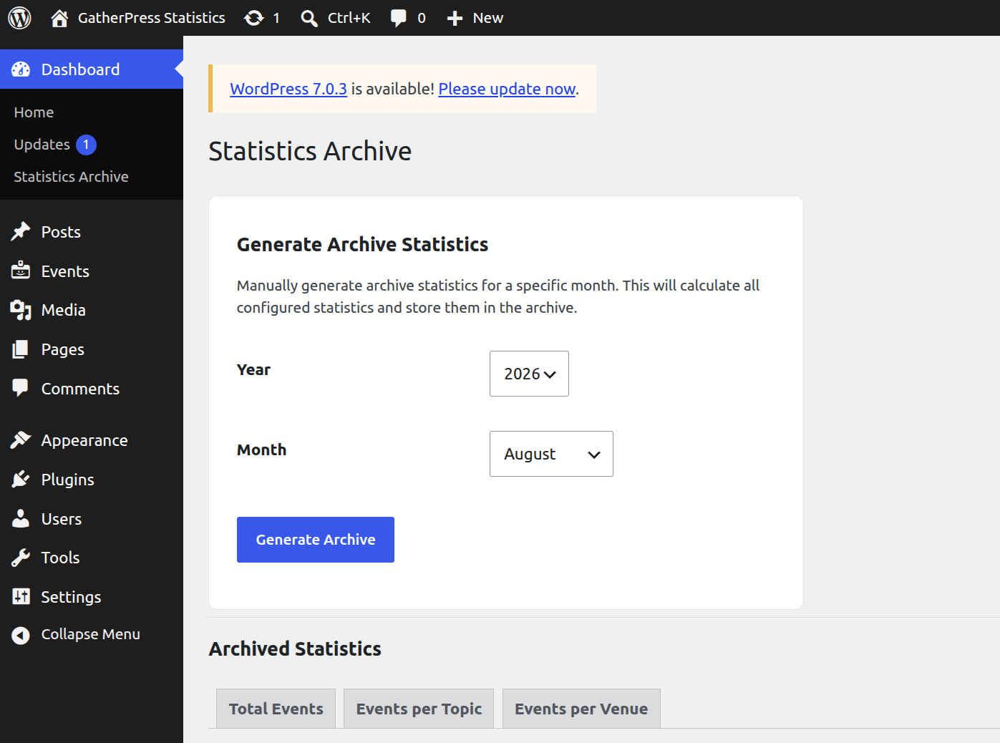

# GatherPress Statistics

Stable tag: 0.1.0  
Tested up to: 7.1  
License: GPL v2 or later  
Tags: block, gatherpress, events, statistics  
Contributors: carstenbach, WordPress Telex  

Adds a "GatherPress Statistics" block that displays cached counts of GatherPress events, taxonomy terms, and attendees.

[](https://playground.wordpress.net/?blueprint-url=https://raw.githubusercontent.com/carstingaxion/gatherpress-statistics/main/.wordpress-org/blueprints/blueprint.json)

## Requirements

* [GatherPress](https://wordpress.org/plugins/gatherpress/) plugin, active
* WordPress 6.1+
* PHP 7.4+

## Features

* **Statistic types:** total events, events per taxonomy term, events across multiple taxonomies (AND relationship), total taxonomy terms, terms-by-taxonomy cross counts, total attendees
* **Post type support system:** each statistic type is enabled or disabled per post type via `add_post_type_support( $post_type, 'gatherpress_statistics', $config )`
* **Dynamic taxonomy support:** works with any taxonomy registered to a supported post type, no code changes needed
* **Context-aware terms:** the block can derive its filter term from the post or archive it's placed on (a Single Event template, a Query Loop item, or a `gatherpress-shadow-source` post type's own singular/archive — e.g. `gatherpress_venue`, `gatherpress_play`) instead of a manually picked term
* **Caching:** statistics are calculated on data change and cached as transients; the frontend only ever reads cached values
* **Four block styles:** Counter, Card, Minimal, Confetti (hover animation)
* **theme.json integration:** exposes styleable elements for the number, label, prefix, and suffix
* **Conditional formatting:** different prefix/suffix text based on a count threshold
* **Event time filtering:** upcoming or past (required; combined upcoming+past is not supported)
* **Semantic HTML:** `<figure>`, `<data value="…">`, `<figcaption>`
* **Statistics Archive Dashboard:** optional admin page (Dashboard → Statistics Archive) with monthly archive generation, filtering/sorting, and a trend chart

## Installation

1. Upload the plugin files to `/wp-content/plugins/gatherpress-statistics`
2. Activate the plugin through the 'Plugins' screen
3. Ensure the GatherPress plugin is installed and activated
4. Add the "GatherPress Statistics" block to any post, page, or template
5. Configure the statistic type and filters in the block's Inspector Controls

## Block Usage

### Basic Usage

1. Add the "GatherPress Statistics" block
2. Select a statistic type in the sidebar
3. Choose upcoming or past events (where applicable)
4. Configure labels and formatting
5. Apply filters (taxonomy, terms) if needed

### Event Time Filtering

* **Upcoming Events** — events scheduled in the future
* **Past Events** — events that already occurred

Not available for taxonomy term counts (`total_taxonomy_terms`, `taxonomy_terms_by_taxonomy`).

### Single Taxonomy Filtering

For "Events per Taxonomy Term" and "Total Attendees":

1. Select a taxonomy
2. Choose a specific term
3. The statistic counts only events with that term

### Multiple Taxonomy Filtering

For "Events (Multiple Taxonomies)":

1. Expand each taxonomy panel in the sidebar
2. Select one or more terms per taxonomy
3. Events must match a term in every taxonomy that has a selection (AND relationship)

### Context-Aware Terms

Instead of a manually picked term, a taxonomy's term can be derived automatically from where the block is rendered:

* **Single-taxonomy statistics:** toggle "Use current post's term" next to the taxonomy selector
* **Multi-taxonomy statistics:** toggle "Use current post's term" on any individual taxonomy panel; the remaining taxonomies keep their manually selected terms

Resolution order:

1. On a Single Event (or other consumer post type) template, the term assigned to that post in the selected taxonomy is used
2. On a `gatherpress-shadow-source` post type's own singular (e.g. a single `gatherpress_venue` or `gatherpress_play` post), that post's own shadow term is used automatically
3. On a `gatherpress-shadow-source` taxonomy's own archive (e.g. a `_gatherpress_venue` term archive), the archived term is used directly
4. Inside a Query Loop, the current loop item is used (via block context)

### Conditional Formatting

1. Set a count threshold
2. Define a default prefix/suffix
3. Define a conditional prefix/suffix used once the count exceeds the threshold

### Block Styles

* **Counter** (default) — number with label below
* **Card** — elevated card with shadow
* **Minimal** — compact, smaller text
* **Confetti** — gradient background, hover animation

## Styling with theme.json

### HTML Structure

```html
<figure class="wp-block-gatherpress-statistics">
  <data class="gatherpress-stats-value" value="42">
    <span class="gatherpress-stats-prefix">Over</span>
    <span class="gatherpress-stats-number">42</span>
    <span class="gatherpress-stats-suffix">and counting</span>
  </data>
  <figcaption class="gatherpress-stats-label">Events</figcaption>
</figure>
```

* `<data>` — holds the numeric value, with a machine-readable `value` attribute
* `.gatherpress-stats-number` — the number
* `.gatherpress-stats-prefix` / `.gatherpress-stats-suffix` — optional prefix/suffix text
* `.gatherpress-stats-label` — the `<figcaption>` label

### Styling Individual Elements

Target any of the classes above under `styles.blocks.gatherpress/statistics.elements` in `theme.json`:

```json
{
  "version": 2,
  "styles": {
    "blocks": {
      "gatherpress/statistics": {
        "elements": {
          ".gatherpress-stats-number": {
            "typography": {
              "fontSize": "4rem",
              "fontWeight": "900",
              "lineHeight": "1"
            },
            "color": { "text": "var(--wp--preset--color--primary)" }
          },
          ".gatherpress-stats-label": {
            "typography": {
              "fontSize": "0.875rem",
              "fontWeight": "600",
              "textTransform": "uppercase",
              "letterSpacing": "0.05em"
            },
            "spacing": { "margin": { "top": "0.5rem" } }
          },
          ".gatherpress-stats-prefix, .gatherpress-stats-suffix": {
            "typography": { "fontSize": "0.75em", "fontWeight": "600" },
            "color": { "text": "var(--wp--preset--color--secondary)" }
          }
        }
      }
    }
  }
}
```

Block-level `spacing`, `border`, and `color` under `styles.blocks.gatherpress/statistics` (outside `elements`) style the `<figure>` wrapper itself. Block style variations (`card`, `minimal`, `confetti`) can be targeted under `styles.blocks.gatherpress/statistics.variations.<name>` the same way.

Use `clamp()` on `.gatherpress-stats-number`/`.gatherpress-stats-label` font sizes for fluid typography across breakpoints.

## Frequently Asked Questions

### Does this require GatherPress?

Yes. It queries GatherPress custom post types and taxonomies directly.

### How often are statistics updated?

Immediately on the backend when an event, venue, or topic is created, modified, or deleted: the cache is cleared and a background job regenerates it. The frontend always reads the cached value.

### Can I display multiple statistics on one page?

Yes, add multiple block instances, each with its own configuration.

### How long are statistics cached?

12 hours by default, configurable via the `gatherpress_statistics_cache_expiration` filter (see [docs/developer/README.md](docs/developer/README.md)). The cache clears automatically whenever relevant data changes, independent of this duration.

### What happens with custom GatherPress taxonomies?

Any taxonomy registered to a supported post type is detected automatically; no code changes needed.

### Can I show statistics for all events (upcoming and past combined)?

No. Every statistic type that supports event-time filtering requires choosing either upcoming or past.

### How do I style the number and label differently?

See [Styling with theme.json](#styling-with-themejson) above.

## Screenshots

1. Block editor interface showing statistic type selection and filtering options 
2. Counter style displaying total events with custom colors 
3. Card style showing events per topic
4. Minimal style integrated into content
5. Confetti style with hover animation 
6. Inspector controls for statistics and filters
7. Multiple taxonomy filter panel
8. Conditional prefix/suffix settings 
9. Statistics Archive Dashboard showing "Total Events" 
10. Statistics Archive Dashboard showing "Total Events per Venue" 
11. Statistics Archive Dashboard panel to generate/regenerate a month's statistics 

## Developer Documentation

Architecture, caching internals, the post type support system, and available hooks (with usage examples) are documented in [docs/developer/README.md](docs/developer/README.md).

## Changelog

All notable changes to this project will be documented in the [CHANGELOG.md](CHANGELOG.md).


## Privacy & Data

This plugin does not collect, store, or transmit any personal data. It queries and caches statistics about your events and taxonomies, stored locally in your WordPress database via the Transients API.
